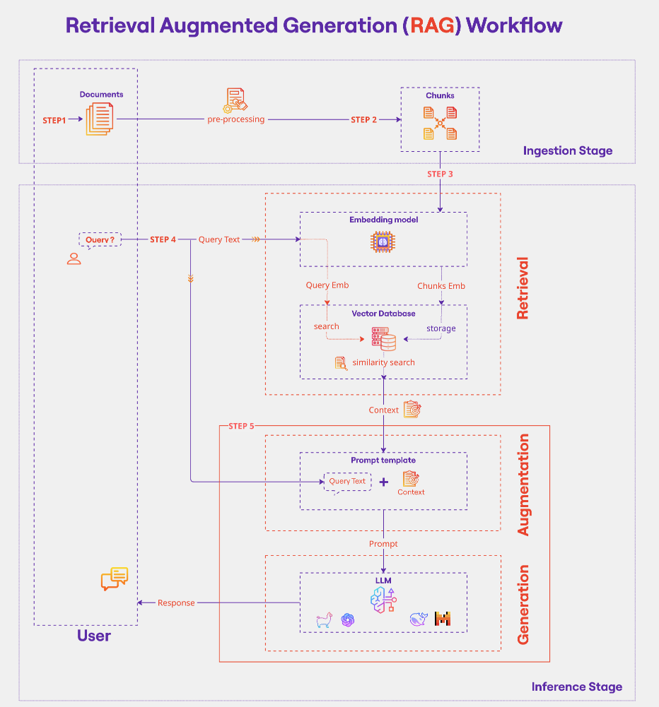
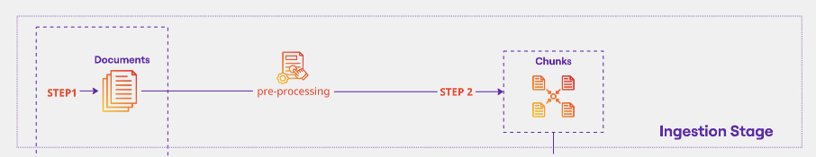
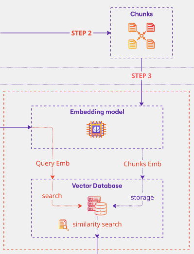
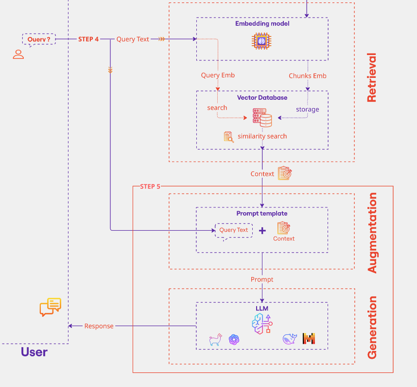

[](https://github.com/neuefische/ds-rag-pipline/actions/workflows/workflow-02.yml)

## Retrieval Augmented Generation (RAG) with LangChain

This workshop teaches how to build RAG systems that overcome Large Language Model limitations by augmenting prompts with retrieved external information from documents.

### What You'll Learn

**Core Concept**: Build RAG systems that address LLM limitations (hallucinations, outdated knowledge, lack of domain-specific data) by retrieving relevant information from external documents and combining it with your queries.

#### Learning Objectives

By completing this workshop, you will:

1. **Understand RAG fundamentals** - Learn why RAG is needed vs. fine-tuning, and how it provides transparent outputs with fewer hallucinations
2. **Document processing** - Load PDFs and chunk text to fit LLM context windows
3. **Embeddings & vector storage** - Convert text to numerical vectors using HuggingFace models and store them in FAISS vector database
4. **Retrieval systems** - Implement semantic similarity search to find relevant documents
5. **LLM integration** - Connect retrieval systems to language models (using free Groq/Llama models)
6. **Build interactive Q&A** - Create a chat interface for querying PDF documents

### Technical Stack

- **LangChain** - Framework for LLM applications
- **FAISS** - Facebook's similarity search library for vector storage
- **HuggingFace Embeddings** - Open-source embedding models
- **Groq/Llama** - Free LLM inference
- **Sample data** - Research papers included for practice (pharmaceutical documentation and AI research)

### Workshop Structure

Two parallel notebooks are provided:
- **RAG-Pipeline-Llama.ipynb** - Complete walkthrough with detailed explanations and working code
- **RAG_Exercise_Notebook.ipynb** - Hands-on exercises with empty functions for you to implement

The workshop covers 7 exercises that guide you through the 5-step RAG pipeline shown below.

### Prerequisites

You will need a free Groq API key. Create a `.env` file in the project root with:
```
GROQ_API_KEY=<your groq api key>
```

- [Groq API Key](https://console.groq.com/playground) can be generated and used free of charge

## Environment

### **`macOS`** type the following commands :


- Install the virtual environment and the required packages by following commands:

    ```BASH
    pyenv local 3.11.3
    python -m venv .venv
    source .venv/bin/activate
    pip install --upgrade pip
    pip install -r requirements.txt
    ```
### **`WindowsOS`** type the following commands :

- Install the virtual environment and the required packages by following commands.

   For `PowerShell` CLI :

    ```PowerShell
    pyenv local 3.11.3
    python -m venv .venv
    .venv\Scripts\Activate.ps1
    python -m pip install --upgrade pip
    pip install -r requirements.txt
    ```

    For `Git-Bash` CLI :
    ```
    pyenv local 3.11.3
    python -m venv .venv
    source .venv/Scripts/activate
    python -m pip install --upgrade pip
    pip install -r requirements.txt
    ```

---

### RAG Workflow Explained

[](https://youtu.be/_HQ2H_0Ayy0?si=YhNR2fJI-D4llrSo)

*Click the image above to watch a video explanation of the RAG workflow*



The RAG system operates in two main stages: **Ingestion** (preparing your knowledge base) and **Inference** (answering user queries).

#### **Ingestion Stage** (Preparing Your Knowledge Base)

This stage happens once to prepare your documents for retrieval.



**STEP 1 - Load Documents**: Start with your source documents (PDFs, text files, etc.)

**STEP 2 - Pre-processing & Chunking**: Split documents into smaller chunks that fit within LLM context windows. This makes retrieval more precise and manageable.



**STEP 3 - Create Embeddings**: Use an embedding model to convert each chunk into a numerical vector representation. These embeddings capture the semantic meaning of the text and are stored in a Vector Database (like FAISS) for efficient similarity search.

#### **Inference Stage** (Answering User Queries)

This stage happens every time a user asks a question and consists of three phases: Retrieval, Augmentation, and Generation.



**Retrieval Phase (Step 4):**
- When a user submits a query, it gets converted into an embedding using the same embedding model
- The system performs similarity search in the Vector Database, comparing the query embedding against stored chunk embeddings
- The most relevant chunks (context) are retrieved based on similarity scores

**Augmentation Phase (Step 5):**
- The original query text is combined with the retrieved context using a prompt template
- This creates an enriched prompt that contains both the user's question and relevant background information

**Generation Phase (Step 5):**
- The enriched prompt is sent to the LLM (Large Language Model)
- The LLM generates a response based on both the query and the retrieved context
- The response is returned to the user

This workflow ensures that the LLM has access to relevant, up-to-date information from your documents, reducing hallucinations and improving answer accuracy.

## Real-World Applications of RAG Systems

RAG systems are deployed across numerous industries where combining retrieval with generation improves accuracy and reduces hallucinations:

### Journalism & Media
- **News archives search and fact-checking** - Verify claims against historical articles and trusted sources
- **Investigative journalism research** - Quickly retrieve relevant past reporting and documents
- **Quote verification and source attribution** - Ensure accuracy of citations and context
- **Historical contextualization** - Connect current events with relevant background information

### Legal
- **Case law research** - Find relevant precedents and legal opinions
- **Contract analysis** - Review and compare contractual language across documents
- **Due diligence** - Search through large document collections efficiently
- **Regulatory compliance** - Query regulations and policy documents

### Healthcare
- **Medical literature search** - Help clinicians find relevant research and treatment guidelines
- **Clinical decision support** - Retrieve patient-specific information and recommendations
- **Drug interaction checking** - Query pharmaceutical databases for safety information
- **Medical education** - Interactive Q&A over medical textbooks and journals

### Customer Support
- **Knowledge base chatbots** - Answer customer questions using company documentation
- **Technical support assistants** - Troubleshoot issues with product manuals
- **FAQ automation** - Provide accurate answers from support articles

### Education
- **Personalized tutoring systems** - Answer student questions using course materials
- **Research paper discovery** - Help students find relevant academic literature
- **Interactive course assistants** - Q&A over textbooks and lecture notes

### Enterprise & Business
- **Internal knowledge management** - Search company wikis, policies, and documentation
- **Compliance Q&A** - Query corporate policies and regulatory requirements
- **Market intelligence** - Retrieve insights from research reports and market data
- **Onboarding assistants** - Help new employees find relevant company information

### Finance
- **Financial report analysis** - Extract insights from earnings reports and filings
- **Investment research** - Query analyst reports and market data
- **Risk assessment** - Retrieve relevant financial regulations and compliance documents
- **Market sentiment analysis** - Analyze news and social media with historical context

### E-commerce
- **Product search and recommendations** - Match customer queries with detailed product specifications
- **Review analysis** - Summarize and query customer feedback
- **Inventory intelligence** - Search catalog data with natural language

### References

- Lewis, P., et al. (2020). "Retrieval-Augmented Generation for Knowledge-Intensive NLP Tasks." *NeurIPS 2020*. [arXiv:2005.11401](https://arxiv.org/abs/2005.11401)
- Gao, Y., et al. (2023). "Retrieval-Augmented Generation for Large Language Models: A Survey." *arXiv preprint*. [arXiv:2312.10997](https://arxiv.org/abs/2312.10997)
- Ram, O., et al. (2023). "In-Context Retrieval-Augmented Language Models." *ACL 2023*. [arXiv:2302.00083](https://arxiv.org/abs/2302.00083)
- Borgeaud, S., et al. (2022). "Improving language models by retrieving from trillions of tokens." *ICML 2022*. [arXiv:2112.04426](https://arxiv.org/abs/2112.04426)
- Izacard, G., & Grave, E. (2021). "Leveraging Passage Retrieval with Generative Models for Open Domain Question Answering." *EACL 2021*. [arXiv:2007.01282](https://arxiv.org/abs/2007.01282)
- A beginner’s guide to building a Retrieval Augmented Generation (RAG) application from scratch[Rag from scratch tutorial](https://learnbybuilding.ai/tutorial/rag-from-scratch/)
